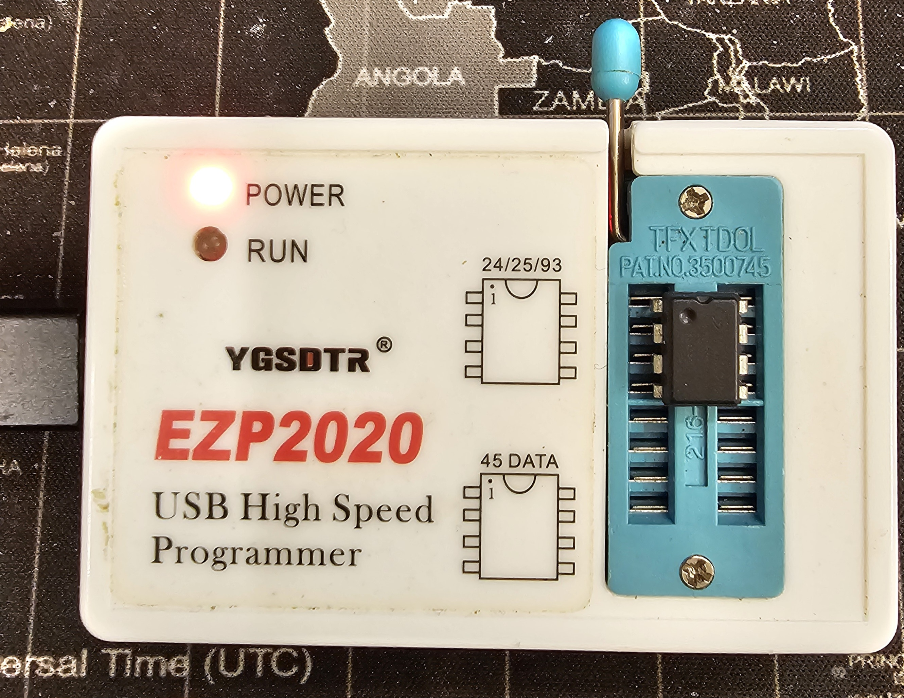
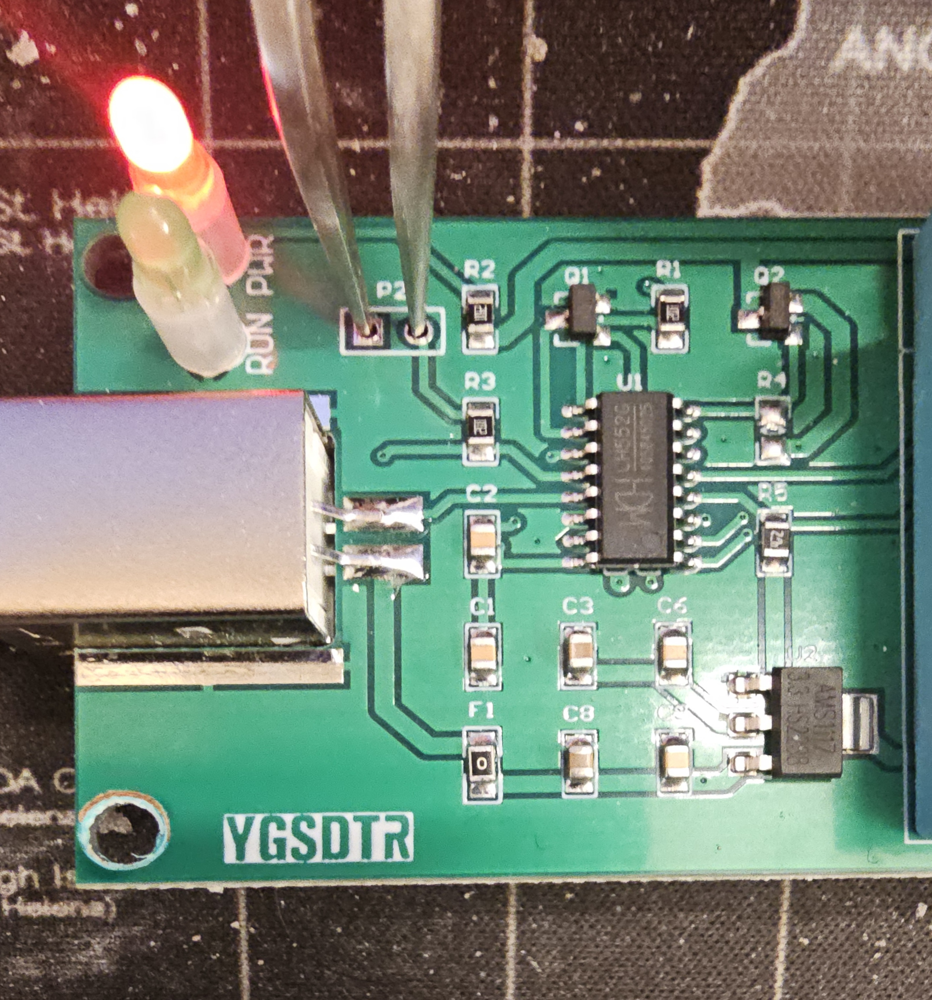
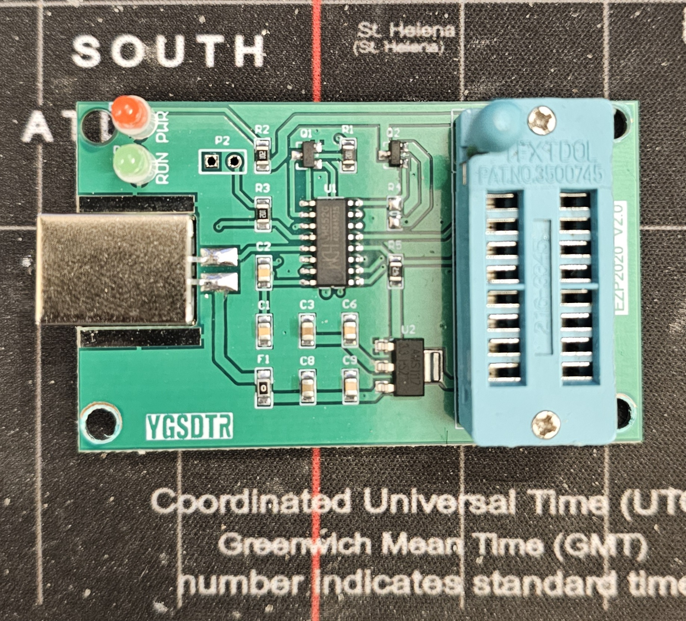
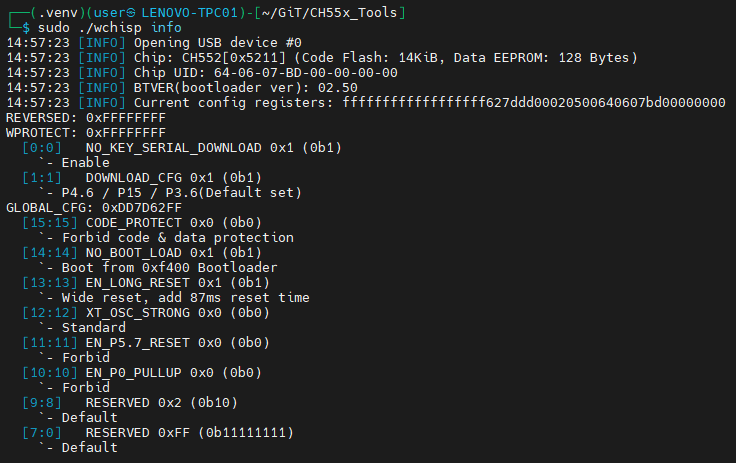
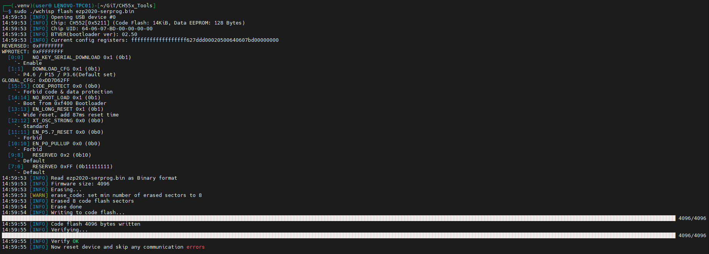
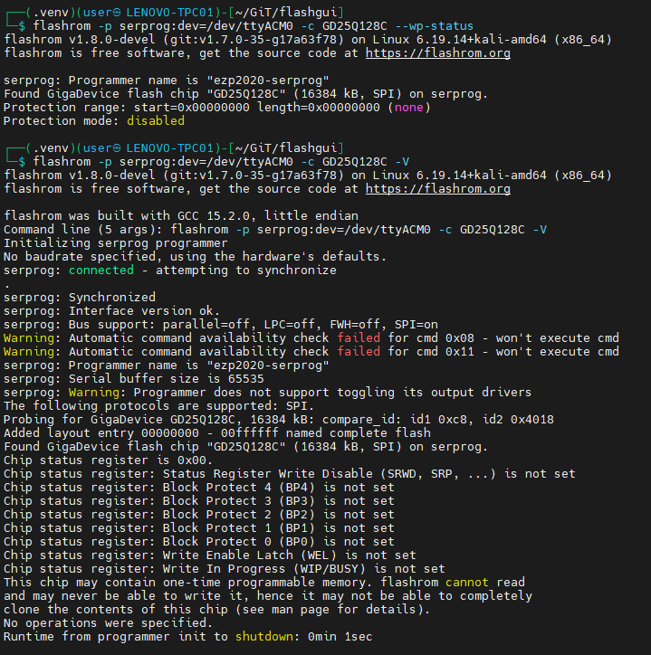

# ezp2020-serprog

Serprog-protocol firmware for the **EZP2020 USB SPI flash programmer** (CH552T MCU).
After flashing this firmware, the EZP2020 becomes a `flashrom`-compatible programmer
using the [Serial Flasher Protocol](https://www.flashrom.org/Serprog).

Based on [ieiao/ch554_sdcc](https://github.com/ieiao/ch554_sdcc) (`serprog` branch),
with minimal hardware adaptations for the EZP2020 board:

| Signal | EZP2020 pin           | ieiao original |
| ------ | --------------------- | -------------- |
| CS     | P1.4                  | P1.0           |
| MOSI   | P1.5                  | P1.5           |
| MISO   | P1.6                  | P1.6           |
| SCK    | P1.7                  | P1.7           |
| LED    | P3.4 (green activity) | P3.3           |

---

## Repository layout

```text
EZP2020_CH552x-FW/
├── README.md                  ← canonical project documentation
├── screenshots/               ← hardware + validation screenshots
├── Tools/
│   ├── build/bin/             ← bundled Windows SDCC toolchain
│   └── flash/                 ← bundled wchisp/WCH flash tools
└── serprog-ezp2020/
   ├── main.c                ← USB CDC + serprog command handler
   ├── serprog.h             ← Serprog protocol constants
   ├── build.bat             ← Windows build script (bundled tools)
   ├── Makefile              ← Linux/macOS build script
   ├── flash.sh              ← Linux flash helper
   └── include/              ← CH55x headers + SPI/debug support
```

---

## Required tools

Windows build and flash tools are bundled in `Tools/build/bin/` and `Tools/flash/`.

If you use the Linux/macOS `Makefile`, install these tools separately or make
sure they are on your `PATH`:

| Tool       | Purpose                                 | Needed for                                        | Source                    |
| ---------- | --------------------------------------- | ------------------------------------------------- | ------------------------- |
| `sdcc`     | Build the CH552 firmware                | Linux/macOS `Makefile`                            | Install separately        |
| `objcopy`  | Convert Intel HEX to raw binary         | Linux/macOS `Makefile`                            | Install separately        |
| `wchisp`   | Flash the CH552 bootloader over USB ISP | Bundled on Windows; optional if already installed | Bundled in `Tools/flash/` |
| `flashrom` | Use the programmer after flashing       | Reading/writing SPI flash chips                   | Install separately        |

Optional Windows helper:

- `WCHISPTool` — Windows GUI alternative to `wchisp`

---

## Quick start

- Open `serprog-ezp2020/`.
- Build firmware: Windows runs `build.bat`; Linux/macOS runs `make`.
- Put the board into ISP mode (short **P2** while plugging USB).
- Flash firmware: Windows runs `Tools/flash/wchisp.exe flash serprog-ezp2020/ezp2020-serprog.bin`; Linux/macOS runs `./Tools/flash/wchisp flash serprog-ezp2020/ezp2020-serprog.bin`.
- Replug the board and use `flashrom` with the new serial device.

---

## Hardware photos







---

## Verification screenshots







---

## Build

### Windows (bundled tools)

```cmd
cd serprog-ezp2020
build.bat
```

### Linux / macOS

```bash
cd serprog-ezp2020
make
```

Build output:

| File                        | Description                        |
| --------------------------- | ---------------------------------- |
| `build/ezp2020-serprog.ihx` | Intel HEX (intermediate)           |
| `ezp2020-serprog.bin`       | Raw binary for flashing via wchisp |

---

## Entering ISP (bootloader) mode

The CH552T has an internal USB bootloader that activates when **P3.6 (BOOT)**
is held HIGH during USB plug-in.

On the **YGSDTR EZP2020 V2.0** board, BOOT is exposed as two square test points
labelled **P2** (near the RUN/PWR LEDs):

1. Unplug USB.
2. Bridge the two **P2** pads.
3. Plug in USB while keeping the short.
4. Release the short.

The device should appear as `VID=4348 PID=55E0`.

---

## Flashing

### Windows — wchisp CLI

```cmd
cd Tools\flash
wchisp.exe flash ..\..\serprog-ezp2020\ezp2020-serprog.bin
```

### Windows — WCHISPTool GUI

Open WCHISPTool, choose `serprog-ezp2020/ezp2020-serprog.bin`, then click **Download**.

### Linux — wchisp

```bash
./Tools/flash/wchisp flash serprog-ezp2020/ezp2020-serprog.bin
```

> **Warning:** `wchisp` has no read/dump subcommand, so you cannot make a USB-ISP
> backup of the factory firmware before flashing. Once you write this firmware,
> the original "USB to I2C / ZhiYuan Wan" image is overwritten and cannot be
> recovered from the board with `wchisp`.
>
> **Disclaimer:** Flash this only if you understand the risk. I’m not responsible
> for any data loss, damaged hardware, or a board that refuses to come back to
> life after flashing.

---

## Using with flashrom

After flashing and re-plugging, the EZP2020 enumerates as a USB CDC virtual
serial port.

### Linux

```bash
flashrom -p serprog:dev=/dev/ttyACM0:4000000
```

### Windows

```cmd
flashrom -p serprog:dev=COM3:4000000
```

Replace device path/COM port as needed.

### SPI speed

The firmware defaults to **1.5 MHz** SPI clock. `flashrom` can negotiate higher
speeds using `S_CMD_S_SPI_FREQ`.

Examples:

```bash
# Linux — 4 MHz
flashrom -p serprog:dev=/dev/ttyACM0:4000000,spispeed=4000000 -r backup.bin

# Linux — 500 kHz (long/noisy wires)
flashrom -p serprog:dev=/dev/ttyACM0:4000000,spispeed=500000 -r backup.bin
```

---

## Troubleshooting — all reads return `0xff`

If every probe shows `id1 0xff, id2 0xffff`, MISO is likely not reaching the MCU:

1. Verify chip orientation and seating in the socket.
2. Verify VCC at chip pin 8 is 3.3 V.
3. Try lower SPI speed (`spispeed=500000`).
4. Ensure `WP#` (pin 3) and `HOLD#` (pin 7) are tied high.
5. Cross-check chip health with another programmer (for example `ch341a_spi`).

---

## USB identity

| Field      | Value             |
| ---------- | ----------------- |
| VID        | 0x1A86 (WCH)      |
| PID        | 0x5722            |
| Programmer | `ezp2020-serprog` |
| Serial     | `202201`          |
| Baud       | ignored (USB CDC) |

---

## Restoring the original firmware

The original firmware identifies as:

| Field        | Value       |
| ------------ | ----------- |
| Product      | USB to I2C  |
| Manufacturer | ZhiYuan Wan |
| Serial       | 2018-3-17   |
| VID:PID      | 1A86:5722   |

There is no way to back up the factory firmware via `wchisp` because it has no
read/dump subcommand. To restore, you need an external copy of the original
binary.
